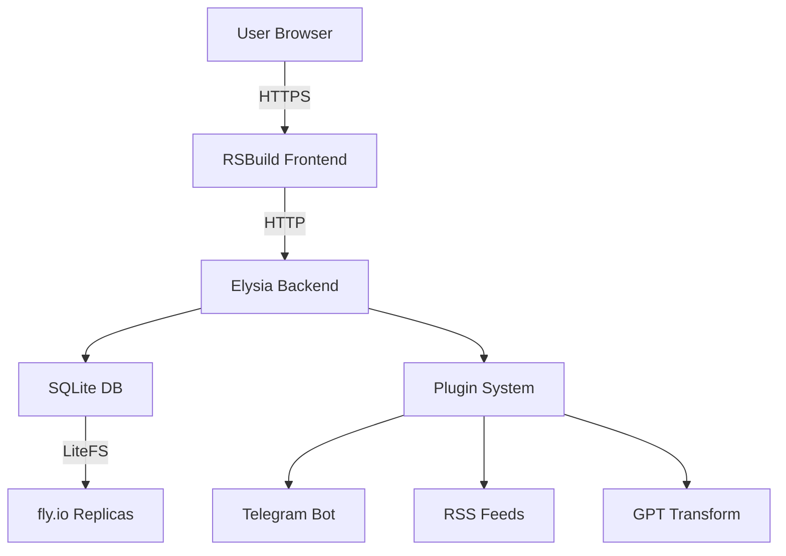
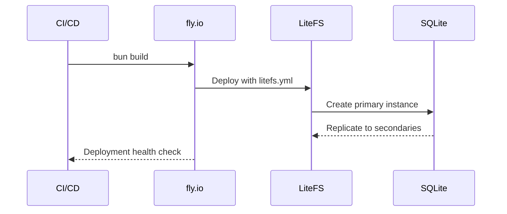

# Curated.fun Architecture Overview

## System Components



## Data Flow

1. **Frontend (RSBuild + TanStack Router)**
   - Routes defined in `frontend/src/routes/`
   - API client in `frontend/src/lib/api.ts`
   - State management via TanStack Query

2. **Backend (Elysia)**
   - Entrypoint: `backend/src/index.ts`
   - Core services:
     - Database: Drizzle ORM (`backend/src/services/db/`)
     - Submissions: `backend/src/services/submissions/`
     - Twitter integration: `backend/src/services/twitter/`
   - Plugin system foundation in `backend/src/types/plugin.ts`

3. **SQLite Database**
   - Schema managed via Drizzle (`backend/drizzle.config.ts`)
   - LiteFS configuration in `litefs.yml`
   - Replicated across fly.io regions

4. **Plugin System**
   - Core interfaces:
   ```typescript
   interface ContentPlugin {
     transform: (content: string) => Promise<string>;
     validate: (content: string) => boolean;
   }
   
   interface DistributionPlugin {
     publish: (content: FeedItem) => Promise<void>;
     subscribe: (callback: (content: FeedItem) => void) => void;
   }
   ```
   - Existing implementations:
     - Telegram (`backend/src/external/telegram.ts`)
     - RSS (`backend/src/external/rss/`)
     - GPT transforms (`backend/src/external/gpt-transform.ts`)

## Deployment Pipeline



## Key Decisions

1. **LiteFS Configuration**
   - Mount point: `/var/lib/litefs`
   - Defined in `Dockerfile` and `fly.toml`
   - Ensures SQLite availability across regions

2. **Shared Types**
   - Frontend/backend alignment via:
   ```typescript
   // Shared FeedItem type
   interface FeedItem {
     id: string;
     content: string;
     timestamp: number;
     source: 'twitter' | 'rss' | 'telegram'; // register an id with the plugin -- we should save what plugins are registered? and cookies
     metadata: Record<string, unknown>;
   }
   ```

3. **Plugin Lifecycle**
   - Registration via config file (`curate.config.json`)
   - Hot-reloading enabled
   - Sandboxed execution
