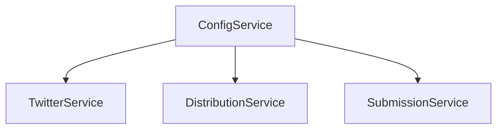

# System Patterns

## Architecture Overview

### Core Components

1. **Server Layer (Elysia.js)**
   - REST API endpoints
   - Static file serving
   - CORS and security middleware
   - Health monitoring
   - High-performance /process endpoint

2. **Service Layer**
   - ConfigService: Configuration management
   - SubmissionService: Platform-agnostic submission handling
   - DistributionService: Content distribution
   - Database Service: Data persistence
   - PluginLoaderService: Dynamic plugin management

3. **Plugin System**
   - Source plugins (Twitter, Telegram, LinkedIn)
   - Distributor plugins (Telegram, RSS, Notion)
   - Transformer plugins (GPT, Simple Transform)
   - Runtime module federation for dynamic loading
   - Plugin development kit with mocks for testing
   - Custom endpoint registration
   - Scheduled task integration

### Design Patterns

1. **Singleton Pattern**
   - Used in ConfigService for global configuration
   - Ensures consistent state across the application

2. **Plugin Pattern**
   - Module federation for runtime plugin loading
   - Standardized plugin interfaces
   - Type-safe plugin configuration
   - Hot-reloading support
   - Plugin caching and invalidation

3. **Service Pattern**
   - Clear service boundaries and responsibilities
   - Platform-agnostic design
   - Encapsulated business logic
   - Dependency injection
   - Extensible action handling

4. **Observer Pattern**
   - Generic content source monitoring
   - Event-driven content processing
   - Configurable action handlers

## Component Relationships

### Configuration Flow

### Content Flow

## Key Technical Decisions

1. **Elysia.js Framework**
   - High performance
   - Built-in TypeScript support
   - Middleware ecosystem
   - Optimized /process endpoint
   - Dynamic endpoint registration

5. **Task Scheduling**
   - Configuration-driven cron jobs
   - Recap generation scheduling
   - Plugin-specific scheduled tasks
   - Reliable execution tracking

2. **Plugin Architecture**
   - Module federation for runtime loading
   - Type-safe plugin interfaces
   - Easy plugin development
   - Comprehensive testing support
   - Hot-reloading capability

3. **Configuration-Driven**
   - JSON-based configuration
   - Runtime configuration updates
   - Environment variable support
   - Extensible action handling
   - Easy forking and customization

4. **Service Architecture**
   - Platform-agnostic services
   - Clear service boundaries
   - Optimized transformer-distributor flow
   - Comprehensive e2e testing
   - Mock system for plugin validation
