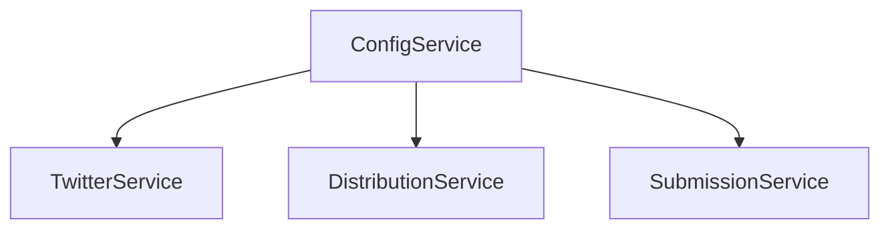
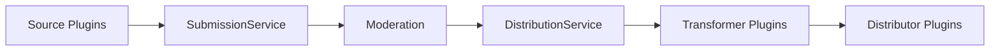

# System Patterns

## Architecture Overview

### Core Components

1. **Server Layer (Elysia.js)**
   - REST API endpoints
   - Static file serving
   - CORS and security middleware
   - Health monitoring
   - High-performance /process endpoint

2. **Service Layer**
   - ConfigService: Configuration management
   - SubmissionService: Platform-agnostic submission handling
   - DistributionService: Content distribution
   - Database Service: Data persistence
   - PluginLoaderService: Dynamic plugin management

3. **Plugin System**
   - Source plugins
     * Twitter (primary content source)
     * Telegram (message monitoring)
     * LinkedIn (planned integration)
   - Distributor plugins
     * Telegram (@curatedotfun/telegram)
     * RSS (@curatedotfun/rss)
     * Notion (@curatedotfun/notion)
     * Supabase (@curatedotfun/supabase)
   - Transformer plugins
     * GPT Transform (AI-powered content enhancement)
     * Simple Transform (Basic formatting)
   - Plugin Features
     * Runtime loading and hot-reloading
     * Type-safe configuration
     * Custom endpoint registration
     * Scheduled task integration
     * Development toolkit with mocks

### Design Patterns

1. **Singleton Pattern**
   - Used in ConfigService for global configuration
   - Ensures consistent state across the application

2. **Plugin Pattern**
   - Standardized Plugin Architecture
     * Consistent interface definitions
     * Type-safe configuration handling
     * Event-driven communication
     * Error boundary implementation
   - Runtime Management
     * Dynamic loading and unloading
     * Hot-reloading capabilities
     * State persistence
     * Resource cleanup
   - Performance Optimization
     * Plugin caching strategies
     * Lazy loading implementation
     * Memory management
     * Resource pooling

3. **Service Pattern**
   - Clear service boundaries and responsibilities
   - Platform-agnostic design
   - Encapsulated business logic
   - Dependency injection
   - Extensible action handling

4. **Observer Pattern**
   - Generic content source monitoring
   - Event-driven content processing
   - Configurable action handlers

## Component Relationships

### Configuration Flow

### Content Flow

## Key Technical Decisions

1. **Performance Optimization**
   - Caching Strategy
     * Plugin-level caching
     * Response caching
     * Configuration caching
   - Load Management
     * Request throttling
     * Load balancing
     * Resource pooling
   - Error Handling
     * Graceful degradation
     * Automatic recovery
     * Error boundaries

2. **Plugin Architecture**
   - Development Experience
     * Comprehensive toolkit
     * Testing utilities
     * Documentation generation
   - Runtime Features
     * Hot-reloading support
     * State management
     * Resource cleanup
   - Integration Points
     * Event system
     * Custom endpoints
     * Scheduled tasks

3. **Testing Infrastructure**
   - Test Categories
     * Unit testing
     * Integration testing
     * E2E testing
     * Performance testing
   - Testing Tools
     * Mock system
     * Test runners
     * CI integration
   - Coverage Goals
     * Code coverage
     * Feature coverage
     * Edge case handling

4. **Monitoring and Analytics**
   - Performance Metrics
     * Response times
     * Resource usage
     * Error rates
   - Usage Analytics
     * Plugin utilization
     * Feature adoption
     * User engagement
   - System Health
     * Service status
     * Resource availability
     * Error tracking
