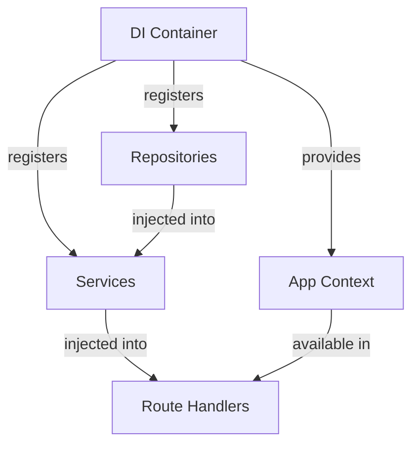
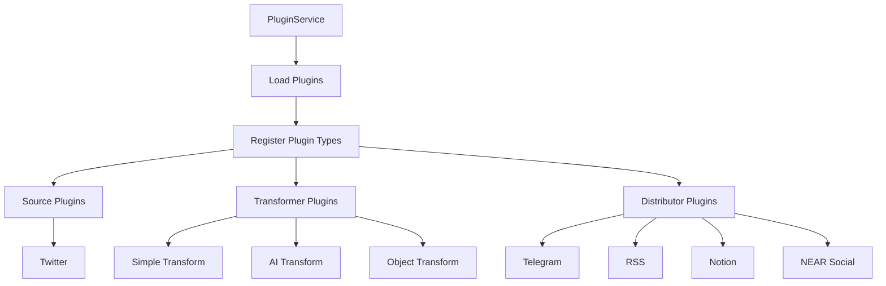
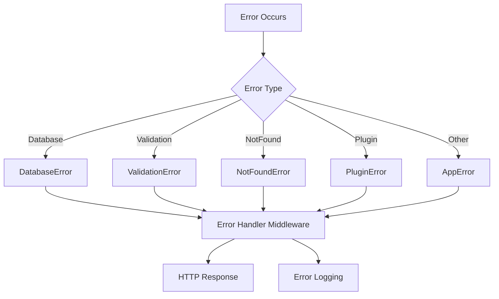

# System Patterns

## Architecture Overview

### Core Components

1. **Core Layer**
   - Type definitions derived from database schema
   - Centralized error handling
   - Dependency injection container
   - Application context

2. **Data Access Layer**
   - Repository pattern with base repository
   - Database connection management
   - Transaction support with retry logic
   - Type-safe database operations

3. **Service Layer**
   - Standardized service initialization
   - Business logic encapsulation
   - Dependency injection via constructors
   - Plugin system with module federation

4. **Presentation Layer**
   - Modular route definitions
   - Request validation with Zod schemas
   - Response formatting
   - Error handling middleware

5. **Plugin System**
   - Runtime loading via module federation
   - Type-safe plugin interfaces
   - Custom endpoint registration
   - Scheduled task integration
   - Development toolkit with mocks

### Database Architecture

1. **PostgreSQL with Drizzle ORM**
   - Read/write separation with connection pools
   - Transaction support with retry logic
   - Comprehensive error handling with context-rich logging
   - Default values for graceful degradation
   - Repository pattern for domain-specific database operations
   - Transaction-based operations for related data
   - Modular organization with clear separation of concerns

2. **Repository Pattern**
   - Base repository with common CRUD operations
   - Domain-specific repositories extending base repository
   - Type-safe operations using generated types
   - Consistent error handling
   - Transaction support

3. **Development Environment**
   - Docker Compose for local development
   - PostgreSQL container with persistent volume
   - Automatic migrations on startup

4. **Testing Environment**
   - Isolated test databases
   - Automated cleanup between test runs
   - Mock system for unit tests
   - Transaction rollbacks for test isolation

### Design Patterns

1. **Dependency Injection**
   - Constructor injection for services and repositories
   - Centralized container for dependency resolution
   - Improved testability through mockable dependencies
   - Clear service boundaries and responsibilities

2. **Repository Pattern**
   - Abstraction over database operations
   - Base repository with common CRUD operations
   - Domain-specific repositories for specialized queries
   - Consistent error handling and transaction support

3. **Type Generation**
   - Types derived from database schema
   - Zod schemas for validation
   - Consistent type usage across layers
   - Reduced type duplication and inconsistencies

4. **Plugin Pattern**
   - Module federation for runtime plugin loading
   - Standardized plugin interfaces
   - Type-safe plugin configuration
   - Hot-reloading support
   - Plugin caching and invalidation

5. **Service Pattern**
   - Clear service boundaries and responsibilities
   - Platform-agnostic design
   - Encapsulated business logic
   - Dependency injection
   - Extensible action handling

6. **Observer Pattern**
   - Generic content source monitoring
   - Event-driven content processing
   - Configurable action handlers

7. **Pipeline Pattern**
   - Transformation pipeline with global and per-distributor transforms
   - Graceful error handling and recovery
   - Configurable transform chains
   - Type-safe transformation flow

8. **Error Handling Pattern**
   - Centralized error definitions
   - Consistent error handling across layers
   - Error recovery strategies
   - Detailed error logging
   - Error aggregation for multiple failures

## Component Relationships

### Core Architecture
```mermaid
graph TD
    A[Database Schema (Drizzle)] -->|Generates| B(Application Types via Zod)
    B --> C{Repositories}
    B --> D{Services}
    B --> E{Routes/Controllers}
    C --> D
    D --> E
    F[Plugin System] --> D
    G[Hono App Core] --> E
    H[Centralized Error Handling] --> G
    I[Dependency Injection Container] --> D
    I --> C
    I --> G

    subgraph Core
        A
        B
    end

    subgraph DataAccessLayer
        C
    end

    subgraph BusinessLogicLayer
        D
        F
        I
    end

    subgraph PresentationLayer
        E
        G
        H
    end
```

### Dependency Injection Flow


### Content Flow

```mermaid
graph LR
    Twitter[TwitterService] --> Submission[SubmissionService]
    Submission --> Moderation[Moderation]
    Moderation --> Processor[ProcessorService]
    Processor --> GlobalTransform[Global Transforms]
    GlobalTransform --> Distribution[DistributionService]
    Distribution --> DistTransform[Distributor Transforms]
    DistTransform --> Distributors[Distributor Plugins]
```


### Plugin System


### Error Handling Flow


## Key Technical Decisions

1. **Type Generation from Schema**
   - Use `drizzle-zod` to generate Zod schemas from Drizzle tables
   - Derive TypeScript types from Zod schemas
   - Single source of truth for data types
   - Consistent validation across application

2. **Dependency Injection**
   - Constructor injection for services and repositories
   - Centralized container for dependency resolution
   - Improved testability through mockable dependencies
   - Clear service boundaries and responsibilities

3. **Modular Route Structure**
   - Dedicated route files for each resource
   - Consistent route handler patterns
   - Request validation with Zod schemas
   - Lean controllers focused on request/response handling

4. **Centralized Error Handling**
   - Custom error classes for different error types
   - Consistent error structure with code, message, and context
   - Global error handler middleware
   - Detailed error logging

5. **Repository Pattern Enhancement**
   - Base repository with common CRUD operations
   - Domain-specific repositories extending base repository
   - Type-safe operations using generated types
   - Consistent error handling and transaction support

6. **PostgreSQL Database**
   - Scalable relational database
   - Read/write separation capability
   - Connection pooling for performance
   - Drizzle ORM for type-safe queries
   - Docker-based development environment

7. **Hono Framework**
   - High performance
   - Built-in TypeScript support
   - Middleware ecosystem
   - Process endpoint for content handling
   - Dynamic endpoint registration

8. **Module Federation Plugin System**
   - Runtime plugin loading without rebuilds
   - Type-safe plugin interfaces
   - Easy plugin development
   - Comprehensive testing support
   - Hot-reloading capability

9. **Configuration-Driven**
   - JSON-based configuration
   - Runtime configuration updates
   - Environment variable support
   - Extensible action handling
   - Easy forking and customization

10. **Service Architecture**
    - Platform-agnostic services
    - Clear service boundaries
    - Optimized transformer-distributor flow
    - Comprehensive testing
    - Mock system for plugin validation

11. **Error Handling**
    - Granular error types
    - Graceful degradation
    - Error recovery strategies
    - Detailed error logging
    - Error aggregation for multiple failures

12. **Task Scheduling**
    - Configuration-driven cron jobs
    - Recap generation scheduling
    - Plugin-specific scheduled tasks
    - Reliable execution tracking

13. **Build System**
    - RSPack for optimized builds
    - Module federation support
    - Fast development experience
    - Efficient bundling
    - TypeScript integration

14. **Deployment Architecture**
    - Docker containerization
    - Railway platform deployment
    - Kubernetes configuration
    - Automated CI/CD pipeline
    - Environment-specific configurations

## File Structure

```
backend/src/
├── core/                           # Core application components
│   ├── types.ts                    # Generated and core application types
│   ├── errors.ts                   # Custom error classes
│   ├── container.ts                # Dependency injection container
│   ├── appContext.ts               # Application context definition
│   └── middleware/                 # Core middleware
│       ├── errorHandler.ts         # Centralized error handler
│       └── validation.middleware.ts # Request validation middleware
├── services/                       # Business logic services
│   ├── config/
│   │   └── config.service.ts
│   ├── distribution/
│   │   └── distribution.service.ts
│   ├── plugin/
│   │   └── plugin.service.ts
│   ├── processor/
│   │   └── processor.service.ts
│   ├── scheduler/
│   │   └── scheduler.service.ts
│   ├── submission/
│   │   └── submission.service.ts
│   ├── transformation/
│   │   └── transformation.service.ts
│   ├── twitter/
│   │   └── twitter.service.ts
│   └── index.ts                    # Service exports
├── services/db/                    # Database services
│   ├── repositories/               # Repository pattern implementation
│   │   ├── base.repository.ts      # Base repository with common CRUD
│   │   ├── feed.repository.ts
│   │   ├── submission.repository.ts
│   │   ├── leaderboard.repository.ts
│   │   └── index.ts
│   ├── connection.ts               # Database connection management
│   ├── schema.ts                   # Drizzle schema definitions
│   └── transaction.ts              # Transaction utilities
├── routes/                         # API routes
│   ├── index.ts                    # Main router
│   ├── submission.routes.ts
│   ├── feed.routes.ts
│   ├── config.routes.ts
│   ├── plugin.routes.ts
│   ├── leaderboard.routes.ts
│   ├── stats.routes.ts
│   ├── trigger.routes.ts
│   └── static.ts                   # Static file serving
├── utils/                          # Utility functions
│   ├── logger.ts
│   ├── config.ts
│   └── sanitize.ts
├── app.ts                          # Application bootstrap
└── index.ts                        # Entry point
```

## Naming Conventions

- **Files**: `kebab-case.ts` (e.g., `submission.service.ts`, `base.repository.ts`)
- **Classes**: `PascalCase` (e.g., `SubmissionService`, `BaseRepository`)
- **Interfaces/Types**: `PascalCase` (e.g., `Submission`, `NewFeed`)
- **Functions/Methods**: `camelCase` (e.g., `getSubmissionById`, `createApp`)
- **Variables/Constants**: `camelCase` for local variables, `UPPER_SNAKE_CASE` for true constants
- **Folders**: `kebab-case.ts` for directories containing multiple related files (e.g., `backend/src/services/submission/`)
